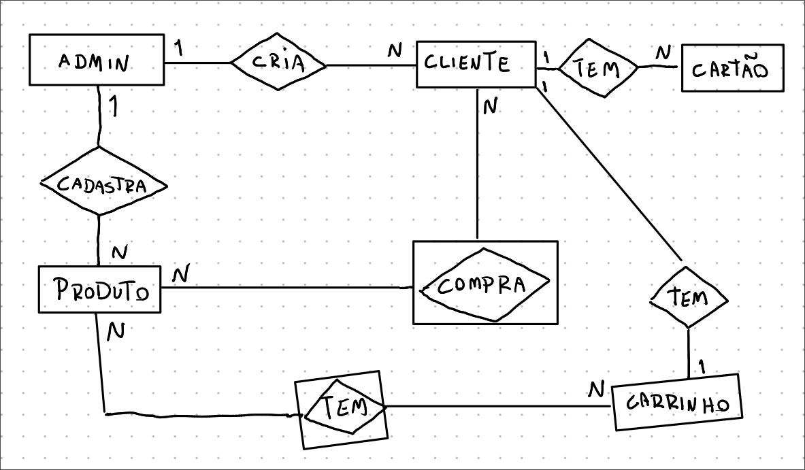
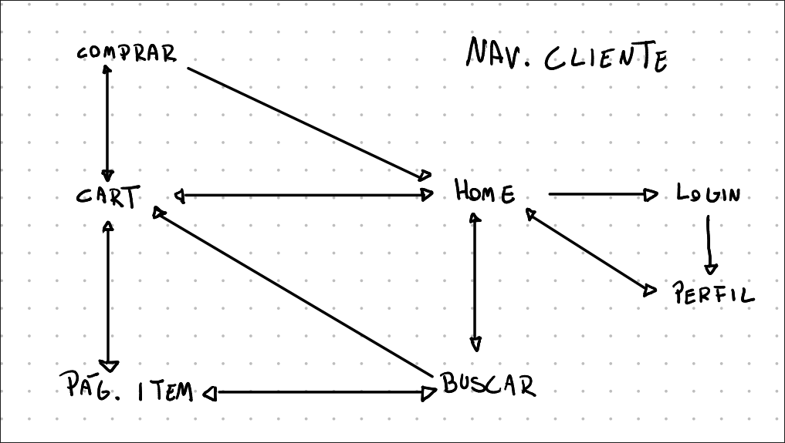
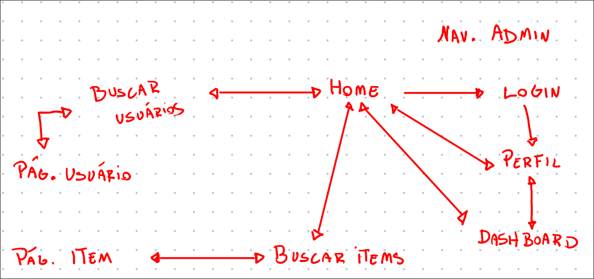

# Loja de eletrônicos
Alunos: Caio Capocasali da Silva - 12541733, Felipe Ferreira Colona - 15636525 e Renan Trofino Silva - 15522316

## Requisitos do sistema
O sistema de loja de produtos eletrônicos possui 3 entidades principais: usuários, produtos e compras. </br>
Usuários são divididos em usuários comuns e administradores, cada qual com suas permissões e funções no sistema. Usuários comuns realizam compras, buscam produtos, etc. Administradores cadastram outros usuários (ambos os tipos) e produtos. </br>
Produtos são adicionados ao sistema e podem ser comprados pelo usuário se existir estoque. Na compra, o usuário deve selecionar o cartão que deseja usar para o pagamento. </br>
Administradores possuem total controle sobre o estoque de produtos, podendo adicionar, alterar ou remover items. </br>
Todos os administradores têm acesso ao dashboard de vendas, que possibilita analisar dados de compras, produtos e usuários para gerar relatórios. </br>

### Modelo entidade-relacionamento para o sistema



Dados das entidades:</br>
- Admin: Id, nome, email, telefone
- Usuário: Id, nome, email, telefone, endereço
- Cartão: Id, id usuário, nome, número
- Produto: Id, nome, descrição, preço, quantidade estoque, marca, desconto (opcional, padrão 0), quantidade vendida, foto (armazena o caminho para a foto)
- Compra: Id, id usuário, id produtos, Id cartão, preço total, data da compra, status (aprovado, etc)
- Carrinho: Id, id usuário, id produtos

### Modelo de navegação (cliente e admin)

</br>



### Esquema da telas (designs e inspirações para implementação)
https://www.figma.com/design/m3WMZW8nlabPySLZ4R0j9Y/web?node-id=0-1&t=CwbLw7NK2zHSW6xv-1

## Descrição do projeto
A loja online de produtos elêtronicos será implementada usando React + Tailwindcss (frontend) e Bun.js + Fastify (backend). </br>
Os dados serão armazenados em um banco de dados, acessado pelo servidor. </br>

### Casos de uso - Administrador
Um admin pode: </br>
- Gerenciar (criar, atualizar, excluir e buscar) produtos
- Gerenciar (criar, atualizar, excluir e buscar) usuários
- Analisar dados de compras já realizadas
- Editar seus próprios dados (alterar senha, etc)

### Casos de uso - Cliente
Um cliente pode: </br>
- Buscar produtos
- Adicionar/excluir produtos em seu carrinho de compras
- Comprar os items em seu carrinho
- Ver compras já realizadas
- Editar seus próprios dados (alterar senha, ect)

### Casos de uso - Produto
- Produtos são criados por administradores
- O estoque e o número de vendas de um produto é atualizado a cada compra que envolva-o
- Administradores podem atribuir descontos aos produtos
- Produtos sem estoque podem ser buscados e exibidos, mas não comprados

### Casos de uso - Cart
- Todo usuário possui um carrinho de compras único e próprio
- O usuário pode adicionar e remover items do carrinho
- Items fora de estoque são excluídos do carrinho
- O carrinho deve somar os valores e aplicar os descontos (se houverem) no total da compra

### Casos de uso - Compra
- Uma compra só pode ser realizada via carrinho de compras
- Caso um item da compra esteja indisponível, o mesmo é retirado da compra e seu valor subtraído
- Caso o usuário não possua cartões, a compra não pode prosseguir
- Ao finalizar uma compra, o carrinho é esvaziado e os produtos são atualizados no estoque

### Casos de uso - Dashboard
- Um admin pode buscar dados de compras na base de dados
- Resultados são exibidos via gráfico ou arquivo para download
  
## Estrutura do projeto
Para melhor organização, o projeto possui 3 sistemas separados: cliente, servidor e cdn.</br></br>
A cdn apenas recebe requisições relacionadas à criação, leitura ou remoção de imagens, salvando-as localmente. </br>
O uso da cdn possibilita servir diretamente conteúdo estático via url (ex: `http://localhost:5000/minha_imagem.jpeg`), evitando uma sobrecarga nos payloads que poderiam conter imagens.</br>

## Comentários sobre o código

## Plano de testes
Os teste foram realizados manualmente de modo a verificar o comportamento do site durante casos de uso esperados e alguns edge cases. Segue o plano de testes realizado.
- Teste de login com as credenciais default de admin
- Teste de CRUD de usuário pelo painel de admin
- Teste de CRUD de produtos pelo painel de admin
- Teste de logout
- Teste de criação de conta de usário (pela tela de cadastro)
- Teste de validação dos inputs na criação de conta
- Teste de login como usuário
- Teste de alteração das informações pessoais
- Teste de validação dos inputs na alteração das informações pessoais
- Teste de compra de produto e validação de estoque
- Teste de CRUD de produtos no carrinho
- Teste de finalização de compra
- Teste de validação dos inputs do meio de pagamento
- Teste de criação de pedido e status de entrega
- Teste de decrescimento de estoque após a compra
- Teste de atualização de dashboard do admin

## Resultados dos testes
Os resultados dos testes, inicialmente, indicaram alguns erros.

## Instalação e execução
Clone este reposiório. </br>
É necessário ter Docker (lembre-se de ativá-lo) e Bun (runtime JS) instalados. </br>
<br/>
Banco de dados (Mongo DB):</br>
```
docker compose up -d
```
<br/>
CDN (rodando em localhost:5000):</br>

```
cd cdn/
```
```
bun install
```
```
bun run dev
```
<br/>
Backend (rodando em localhost:3000):</br>

```
cd backend/
```
```
bun install
```
```
bun run dev
```
<br/>
Frontend (rodando em localhost:5173):</br>

```
cd frontend/
```
```
bun install
```
```
bun run dev
```

## Problemas

## Comentários adicionais
Para facilitar o desenvolvimento, as seguintes bibliotecas/frameworks forma utilizadas: <br/>
- React + Vite + Bun (webpack de desenvolvimento)
- Tailwindcss (estilos)
- Shadcn/ui (componentes estilizados)
- Zod + React Hook Form (esquemas e validação de formulários)
- Tanstack Router (roteamento/páginas)
- Tanstack Query (consumo de APIs e caching)
